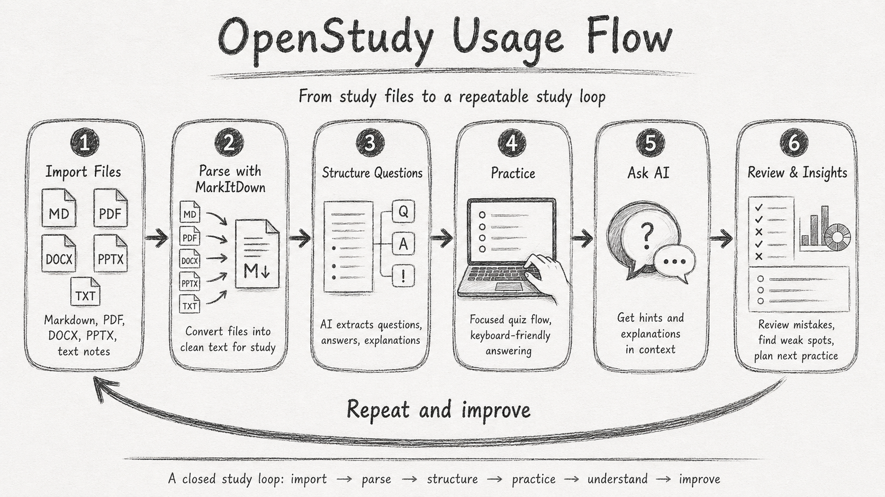
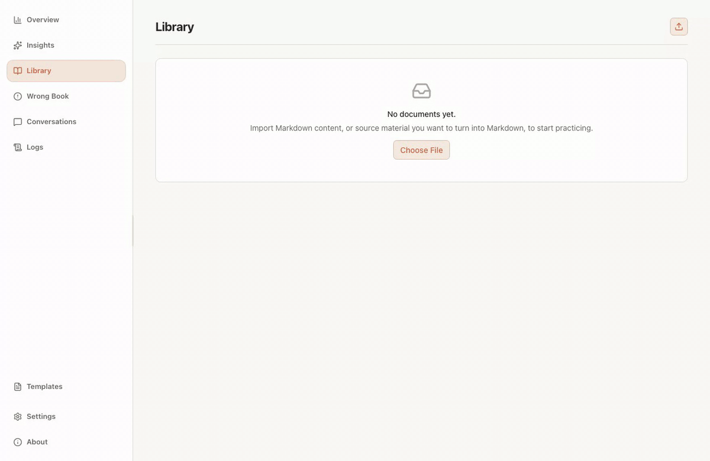

<div align="center">

<picture>
  <source media="(prefers-color-scheme: dark)" srcset="public/logo_white.png">
  
</picture>

# OpenStudy

<p><strong>From Markdown notes to deliberate practice.</strong></p>

<p>OpenStudy is a Markdown-first AI study workspace for turning raw notes and imported documents into structured questions, focused practice, explainable feedback, and a study loop you can keep using every day.</p>

[](https://github.com/Freakz2z/OpenStudy/releases)
[](https://github.com/Freakz2z/OpenStudy/actions/workflows/release.yml)
[](LICENSE)
[](https://github.com/Freakz2z/OpenStudy/releases)
[](https://www.electronjs.org/)
[](https://react.dev/)
[](https://www.typescriptlang.org/)

[English](README.md) · [简体中文](README.zh-CN.md) · [Contributing](CONTRIBUTING.md) · [Code of Conduct](CODE_OF_CONDUCT.md) · [Releases](https://github.com/Freakz2z/OpenStudy/releases) · [Changelog](CHANGELOG.md) · [Report an Issue](https://github.com/Freakz2z/OpenStudy/issues)

</div>

<p align="center">
  
</p>

## Why OpenStudy

OpenStudy is built around a very specific frustration: we already have the notes, the excerpts, and the question drafts, but turning them into a repeatable practice system still feels too manual.

Instead of treating a Markdown note set as a dead asset, OpenStudy turns it into a structured practice space:

- Start from Markdown-first study material and editable question-bank content.
- Use AI to clean up and normalize multiple-choice, fill-in-the-blank, and short-answer questions.
- Practice inside a focused quiz flow with keyboard-friendly navigation.
- Ask AI in context when you need explanation instead of just an answer.
- Review mistakes, retry questions, and track progress over time.
- Generate study insights manually when you actually want them, not every time you open the page.

## What You Can Do

- **Markdown-first by default**: keep your source material editable, durable, and versionable.
- **Bring documents into Markdown, not into a black box**: convert PDF, Word, PowerPoint, HTML, CSV, and more through MarkItDown, then keep working in a clean Markdown workflow.
- **AI cleanup, not AI chaos**: turn rough notes into usable questions without giving up structure.
- **Practice built for repetition**: move fast with shortcuts, retries, and bottom-pinned core actions.
- **Ask AI in the right moment**: get hints, explanations, and reasoning exactly where confusion appears.
- **Review that compounds**: revisit wrong answers, track weak spots, and generate insights only when needed.
- **Ready to distribute**: ship installers for Windows, Apple Silicon macOS, and Linux from one release flow.

## At A Glance

1. **Import Markdown**: start from a Markdown question bank and bring it straight into a durable study workspace.
2. **Review and practice**: inspect the source, launch a focused quiz flow, and use keyboard-friendly actions for repetition.
3. **Ask AI in context**: get hints or explanations without leaving the current question.
4. **Close the loop**: revisit mistakes in Wrong Book and generate Insights manually when you are ready to reflect.

## Demo

<p align="center">
  
</p>

The demo above follows the real app loop: `Import Markdown -> Review Source -> Practice -> Ask AI -> Wrong Book -> Redo -> Generate Insights`.

## Markdown-First, Not Markdown-Only

OpenStudy keeps Markdown as the editable source of truth, but it does not force every source file to begin as Markdown.

MarkItDown works as the import gateway for formats such as PDF, Word, PowerPoint, HTML, CSV, Excel, EPUB, and selected image-based inputs. The converted result then flows back into the same Markdown-first review, identification, practice, and retry pipeline.

Key CLI checks:

```bash
node bin/openstudy.mjs doctor
node bin/openstudy.mjs setup markitdown
node bin/openstudy.mjs convert ./notes.pdf -o ./notes.md
node bin/openstudy.mjs ingest ./slides.pptx --title "Algorithms Review"
```

## Standards

OpenStudy uses a two-layer standard:

- **Author-facing Markdown** is the format you edit, diff, review, and keep in Git.
- **Canonical JSON** is the internal structured contract for validation, automation, and future integrations.

The canonical schema lives at [`schemas/openstudy-question-set.schema.json`](schemas/openstudy-question-set.schema.json), and the CLI can print or locate it with `openstudy standards schema --print`.

Markdown is still opinionated. We use one stable question layout so AI cleanup, parsing, retry flows, and review all behave predictably.

- Field labels stay ASCII: `Type:`, `Answer:`, `Explanation:`, optionally `Topic:` and `Tags:`.
- Allowed `Type` values are `choice`, `multiple`, `judge`, `fill`, `short`, and `code`.
- `Type:` should appear inside each question block before `Answer:`.
- For code-analysis questions, keep the code block with the stem and place `Type:` below the options, not above the code.

<details>
  <summary><strong>choice</strong> - Multiple Choice</summary>

```md
## Multiple Choice

### 1. Which JUnit 5 API is used to verify an exception?

- A. assertThrows
- B. assertAll
- C. assertEquals
- D. assertNotNull

Type: choice
Answer: A
Explanation: JUnit 5 uses assertThrows to verify exceptions.
```

</details>

<details>
  <summary><strong>multiple</strong> - Multiple Select</summary>

```md
## Multiple Select

### 1. Which of the following are JUnit 5 annotations?

- A. @Test
- B. @BeforeAll
- C. @Override
- D. @Disabled

Type: multiple
Answer: ABD
Explanation: @Override is a Java annotation, not a JUnit 5 annotation.
```

</details>

<details>
  <summary><strong>judge</strong> - True or False</summary>

```md
## True or False

### 1. @WebMvcTest is a full Spring integration testing annotation.

- [ ] True
- [ ] False

Type: judge
Answer: False
Explanation: @WebMvcTest only loads the web layer slice.
```

</details>

<details>
  <summary><strong>fill</strong> - Fill in the Blank</summary>

```md
## Fill in the Blank

### 1. The Spring Boot annotation used for controller tests is ____.

Type: fill
Answer: @WebMvcTest
Explanation: It is used for web-layer slice testing.
```

</details>

<details>
  <summary><strong>short</strong> - Short Answer</summary>

```md
## Short Answer

### 1. Briefly describe the basic TDD workflow.

Type: short
Answer: Red, green, refactor.
Explanation: A semantically equivalent answer is acceptable.
```

</details>

<details>
  <summary><strong>code</strong> - Code Analysis</summary>

````md
## Code Analysis

### 1. Read the code below. Which description is correct?

```java
@WebMvcTest(UserController.class)
public class UserApiTest {
    @Autowired
    private MockMvc mockMvc;
}
```

- A. It loads every Spring bean
- B. It is used for controller slice testing
- C. It automatically launches a browser
- D. It is only used for database migration

Type: code
Answer: B
Explanation: @WebMvcTest is used for controller slice testing.
````

</details>

## CLI

The desktop app and CLI share the same service layer, database, and question standard. The CLI is meant for conversion, ingestion, validation, export, automation, and LLM-backed study workflows.

<details>
  <summary><strong>Health, setup, and conversion</strong></summary>

```bash
openstudy doctor
openstudy setup markitdown [--spec "markitdown[all]"]
openstudy convert <file> [--output out.md] [--lang zh|en]
openstudy ingest <file> [--title TITLE] [--lang zh|en] [--skip-identify]
```

</details>

<details>
  <summary><strong>Documents and Markdown</strong></summary>

```bash
openstudy docs list [--format json|table]
openstudy docs import <file> [--title TITLE]
openstudy markdown get <docId> [--output out.md]
openstudy markdown set <docId> <file.md>
```

</details>

<details>
  <summary><strong>Questions and standards</strong></summary>

```bash
openstudy questions identify <docId> [--lang zh|en]
openstudy questions list <docId> [--format json|table]
openstudy questions export <docId> [--format json|markdown] [--output file]
openstudy validate <file.(md|json)> [--format markdown|json] [--lang zh|en]
openstudy exam import <docId> <file.(md|json)>
openstudy standards schema [--print]
openstudy standards markdown [--lang zh|en]
```

</details>

<details>
  <summary><strong>Practice, wrong book, and stats</strong></summary>

```bash
openstudy attempts add <questionId> --answer "..." [--correct]
openstudy attempts wrong
openstudy attempts recent [--limit 20]
openstudy attempts clear --all | --doc <docId> | --question <questionId>
openstudy stats overall [--format json|table]
openstudy stats doc <docId> [--format json|table]
```

</details>

<details>
  <summary><strong>AI and settings</strong></summary>

```bash
openstudy ai test
openstudy ai ask <questionId> --prompt "..."
openstudy ai grade <questionId> --answer "..." [--save]
openstudy ai insights [--doc <docId>] [--limit 80] [--language zh|en]
openstudy settings show
openstudy settings llm --provider deepseek --model deepseek-chat [--base-url URL] [--api-key KEY] [--vision-model MODEL]
```

</details>

## Downloads

Download platform builds from the [Releases page](https://github.com/Freakz2z/OpenStudy/releases).

| Platform | Package | Architecture | Notes |
| --- | --- | --- | --- |
| Windows | `.exe` installer | `x64` | Unsigned installers may show SmartScreen on first launch. |
| macOS | `.dmg` | `arm64` | Apple Silicon only. Unsigned apps may require right-click → Open on first launch. |
| Linux | `.AppImage`, `.deb` | `x64` | Pick the format that best fits your distribution. |

## AI Providers

OpenStudy supports multiple LLM backends for question extraction, grading, AI chat, and insights:

- DeepSeek
- OpenAI-compatible providers
- OpenAI
- Anthropic
- Ollama
- xAI-compatible setups through the OpenAI-style endpoint flow

DeepSeek is a practical default for Chinese study content because it works well with structured JSON output and keeps costs low.

## Development

Requirements: Node.js 20+ and a working desktop build environment for Electron.

```bash
npm install
npm run dev
```

Quality checks:

```bash
npm run typecheck
npm run test:unit
```

Production packaging:

```bash
npm run dist:win
npm run dist:mac
npm run dist:linux
```

Build outputs are written to `release/<version>/`.

## TODO List

- [x] Keep Markdown as the canonical editable study format.
- [x] Support document ingestion through MarkItDown and a shared CLI workflow.
- [x] Ship normalized installers for Windows, Apple Silicon macOS, and Linux.
- [x] Exam mode with timer, deferred grading, and batch submission.
- [x] Claude Code Skill integration with 10 slash commands and full workflow support.
- [ ] Improve OCR- and vision-heavy import quality beyond the base MarkItDown environment.
- [ ] Add smarter handling for very large study sets that exceed model-context limits.

## Product Pillars

OpenStudy ships across four complementary surfaces, each at a different maturity level:

| Pillar | What It Is | Status |
|--------|-----------|--------|
| **Desktop** | Electron app — library, practice, exam, insights, settings | ~90% |
| **CLI** | `openstudy` command — ingest, convert, validate, export, stats, AI | ~85% |
| **Skill** | Claude Code slash commands — 10 `/openstudy:*` commands + workflow orchestration | ~80% |
| **Standard** | OpenStudy Markdown/JSON format — dual-layer, schema-validated, six question types | ~80% |

### Claude Code Skill Integration

The project ships 10 installable slash commands under `.claude/skills/openstudy/` so you can operate the entire study workflow directly inside Claude Code, Codex, or OpenClaw:

| Command | Action |
|---------|--------|
| `/openstudy:ingest` | Import a document and identify questions |
| `/openstudy:identify` | Run AI question identification on a document |
| `/openstudy:exam` | Import a Standard Markdown/JSON question set |
| `/openstudy:export` | Export questions as Standard Markdown or JSON |
| `/openstudy:validate` | Validate question format against the OpenStudy standard |
| `/openstudy:grade` | Grade short-answer and fill-in-the-blank answers with AI |
| `/openstudy:insights` | Generate AI study insights from wrong-answer history |
| `/openstudy:stats` | View overall or per-document learning statistics |
| `/openstudy:doctor` | Diagnose CLI environment and dependencies |
| `/openstudy:settings` | View or change LLM configuration |

The main entry point `/openstudy` also includes a full question-generation specification — type selection strategy, per-type writing guidelines, difficulty calibration, and a quality checklist — so the AI can produce well-formed question sets from your knowledge material.

See [`STUDY.md`](STUDY.md) for the complete Skill documentation and format specification.

## Exam Mode

The desktop app supports two study modes:

- **Practice Mode** — per-question immediate feedback, AI help, peek-at-answer, correct/wrong navigation. Best for learning and review.
- **Exam Mode** — no immediate feedback, no AI help, no peek-at-answer, timer, batch grading at submit, can change answers before submit, localStorage persistence. Best for self-assessment and testing.

Navigate to any document in the Library and click the exam button (clipboard icon) to start an exam session.

## Contributing

Contributions, bug reports, UX suggestions, and packaging improvements are welcome. See [CONTRIBUTING.md](CONTRIBUTING.md) before opening a pull request.

## License

[MIT](LICENSE)
