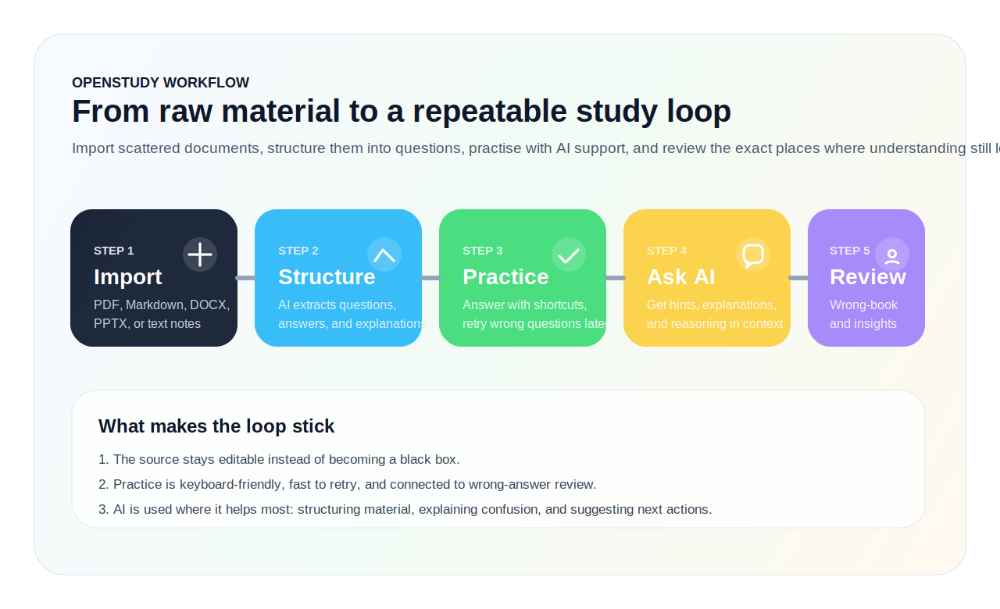
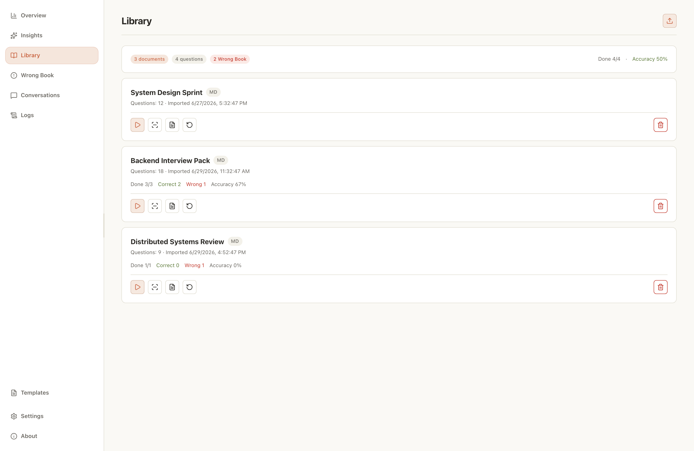
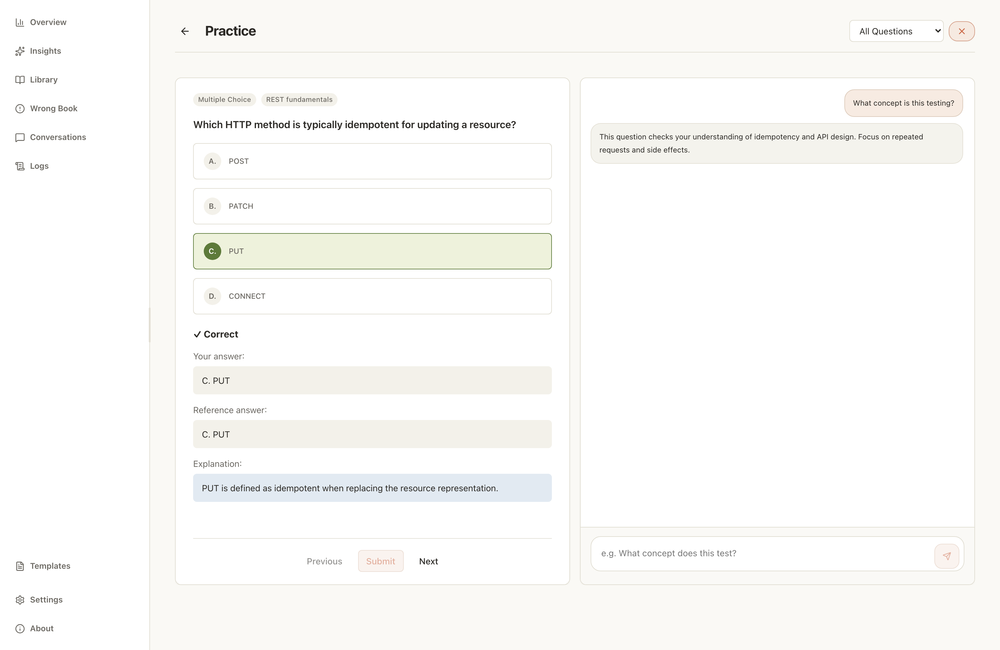
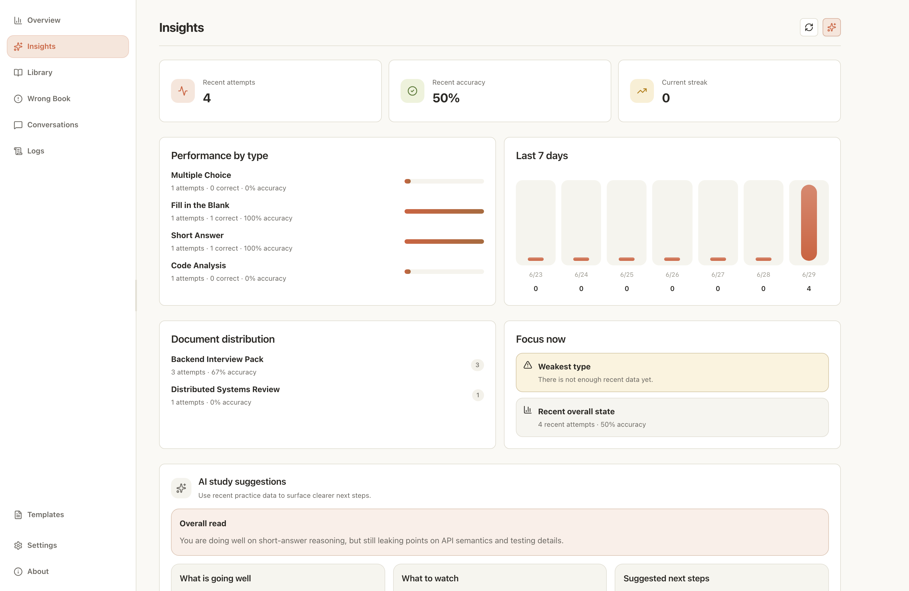

<div align="center">

<picture>
  <source media="(prefers-color-scheme: dark)" srcset="public/logo_white.png">
  
</picture>

# OpenStudy

<p><strong>From Markdown notes to deliberate practice.</strong></p>

<p>OpenStudy is a Markdown-first AI study workspace for turning raw notes into structured questions, focused practice, explainable feedback, and a study loop you can keep using every day.</p>

[](https://github.com/Freakz2z/OpenStudy/releases)
[](https://github.com/Freakz2z/OpenStudy/actions/workflows/release.yml)
[](LICENSE)
[](https://github.com/Freakz2z/OpenStudy/releases)
[](https://www.electronjs.org/)
[](https://react.dev/)
[](https://www.typescriptlang.org/)

[English](README.md) · [简体中文](README.zh-CN.md) · [Contributing](CONTRIBUTING.md) · [Code of Conduct](CODE_OF_CONDUCT.md) · [Releases](https://github.com/Freakz2z/OpenStudy/releases) · [Changelog](CHANGELOG.md) · [Report an Issue](https://github.com/Freakz2z/OpenStudy/issues)

</div>

<p align="center">
  
</p>

## Why OpenStudy

OpenStudy is built around a very specific frustration: we already have the notes, the excerpts, and the question drafts, but turning them into a repeatable practice system still feels too manual.

Instead of treating a Markdown note set as a dead asset, OpenStudy turns it into a structured practice space:

- Start from Markdown-first study material and editable question-bank content.
- Use AI to clean up and normalize multiple-choice, fill-in-the-blank, and short-answer questions.
- Practice inside a focused quiz flow with keyboard-friendly navigation.
- Ask AI in context when you need explanation instead of just an answer.
- Review mistakes, retry questions, and track progress over time.
- Generate study insights manually when you actually want them, not every time you open the page.

## Highlights

- **Markdown-first by default**: keep your source material editable, durable, and versionable.
- **AI cleanup, not AI chaos**: turn rough notes into usable questions without giving up structure.
- **Practice built for repetition**: move fast with shortcuts, retries, and bottom-pinned core actions.
- **Ask AI in the right moment**: get hints, explanations, and reasoning exactly where confusion appears.
- **Review that compounds**: revisit wrong answers, track weak spots, and generate insights only when needed.
- **Ready to distribute**: ship installers for Windows, Apple Silicon macOS, and Linux from one release flow.

## Usage Flow

OpenStudy is designed as a closed learning loop, not just a one-way content formatter. The current diagram above is still a placeholder visual and will be replaced later.

## Screenshots

<p align="center">
  
  
  
</p>

## Downloads

Download platform builds from the [Releases page](https://github.com/Freakz2z/OpenStudy/releases).

| Platform | Package | Architecture | Notes |
| --- | --- | --- | --- |
| Windows | `.exe` installer | `x64` | Unsigned installers may show SmartScreen on first launch. |
| macOS | `.dmg` | `arm64` | Apple Silicon only. Unsigned apps may require right-click → Open on first launch. |
| Linux | `.AppImage`, `.deb` | `x64` | Pick the format that best fits your distribution. |

## AI Providers

OpenStudy supports multiple LLM backends for question extraction, grading, AI chat, and insights:

- DeepSeek
- OpenAI-compatible providers
- OpenAI
- Anthropic
- Ollama
- xAI-compatible setups through the OpenAI-style endpoint flow

DeepSeek is a practical default for Chinese study content because it works well with structured JSON output and keeps costs low.

## Development

Requirements: Node.js 20+ and a working desktop build environment for Electron.

```bash
npm install
npm run dev
```

Quality checks:

```bash
npm run typecheck
npm run test:unit
```

Production packaging:

```bash
npm run dist:win
npm run dist:mac
npm run dist:linux
```

Build outputs are written to `release/<version>/`.

## Release Automation

GitHub Actions builds platform installers on:

- `windows-2025` for Windows `x64`
- `macos-15` for Apple Silicon macOS `arm64`
- `ubuntu-24.04` for Linux `x64`

The workflow is triggered only when a new GitHub Release is published.

If a matching file such as `.github/RELEASE_NOTES_v0.1.0.md` exists, the release workflow uses it as the curated release body and appends GitHub's generated notes beneath it.

Generated installers are normalized to a consistent naming scheme:

- `OpenStudy-<version>-windows-x64-installer.exe`
- `OpenStudy-<version>-macos-arm64.dmg`
- `OpenStudy-<version>-linux-x64.AppImage`
- `OpenStudy-<version>-linux-x64.deb`

## Current Scope

OpenStudy is already useful, but it is still intentionally lean:

- The product direction is now firmly Markdown-first.
- Very large Markdown sets are not yet automatically restructured beyond model limits.
- The project is still evolving toward a more complete open-source study workflow.

## Open Source Notes

The repository is being prepared for a fuller open-source release experience, including polished documentation, cross-platform packaging, and release automation.

## Contributing

Contributions, bug reports, UX suggestions, and packaging improvements are welcome. See [CONTRIBUTING.md](CONTRIBUTING.md) before opening a pull request.

## License

[MIT](LICENSE)
